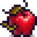

# PixelFood

Sixty-four pixel-perfect food and drink sprites.

- <https://henrysoftware.itch.io/godot-pixel-food>
- <https://rakkarage.github.io/PixelFood/>
- <https://guthub.com/rakkarage/PixelFood/>
- <https://bitbucket.org/rakkarage/PixelFood/>

